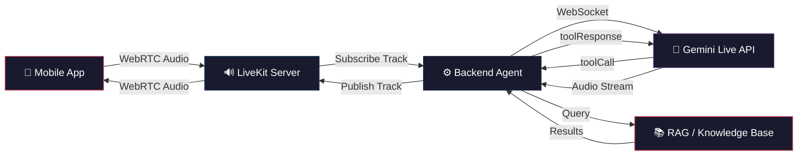
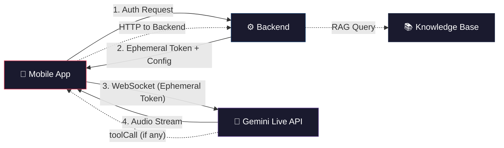
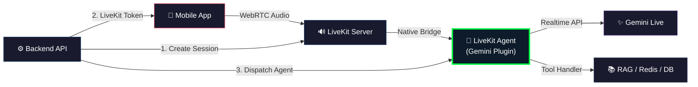
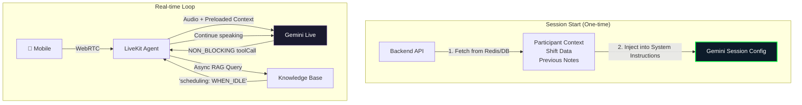

# SENA Voice Architecture Analysis
## Ultra-Low Latency Voice Agent with Context Injection

---

## Validation Analysis

### Your Proposed Architecture — Verdict: ✅ Architecturally Sound, But Not Optimal

Your proposed architecture (LiveKit WebRTC → Backend Agent → Gemini WebSocket → Tool Calling for RAG) is **fundamentally correct** in its design principles. It solves the three core problems:

1. **Security** — API key stays server-side ✅
2. **Low latency** — WebRTC transport eliminates HTTP round-trips ✅  
3. **Context injection** — System Instructions at setup + Tool Calling for dynamic data ✅

However, after deep analysis of your existing codebase, the Gemini Live API documentation, and LiveKit's agent framework, I've identified **critical optimizations and an alternative approach that is materially better**.

### What You Got Right

| Design Decision | Assessment |
|---|---|
| WebRTC relay via LiveKit instead of direct frontend | ✅ Correct — eliminates API key exposure |
| System Instructions in `setup` frame | ✅ Correct — zero latency for static persona/rules |
| Tool Calling for dynamic RAG | ✅ Correct pattern — Gemini Live API natively supports this |
| Backend owns the Gemini WebSocket | ✅ Correct for NDIS compliance — all data stays server-side |

### What's Suboptimal

> [!WARNING]
> **Hidden Latency Trap #1: Your architecture has an unnecessary audio relay hop.**
> 
> In your proposed design, audio flows: `Client → LiveKit → Your Backend Agent → Gemini WebSocket`. Your backend is **manually subscribing to the WebRTC audio track, decoding it, and re-encoding it** to send over the Gemini WebSocket. This adds **50-150ms** per direction and introduces codec transcoding overhead.

> [!WARNING]  
> **Hidden Latency Trap #2: Synchronous Tool Calling pauses the audio stream.**
> 
> When Gemini issues a `toolCall`, the default behavior (`BLOCKING`) **pauses all audio output** until your backend responds with a `toolResponse`. If your RAG query takes 200ms, the user hears **dead silence** for that duration. This breaks conversational flow for a voice-first experience.

> [!IMPORTANT]
> **Architecture Gap: You're reimplementing what LiveKit Agents already provides.**
> 
> LiveKit has a production-ready [Agents Framework](https://docs.livekit.io/agents/) with a native [Gemini Realtime Plugin](https://docs.livekit.io/agents/models/realtime/plugins/gemini/) that handles the WebRTC ↔ Gemini Live API bridge, VAD, barge-in, and tool execution — all without you writing the audio relay code yourself.

---

## Vulnerabilities & Bottlenecks

### Security Validation

Your assumption about WebRTC relay vs. frontend API exposure is **correct and validated**:

| Approach | API Key Exposed? | Data Residency Control | Audit Trail | Verdict |
|---|---|---|---|---|
| **Direct Frontend → Gemini** | ❌ Exposed even with ephemeral tokens* | ❌ Audio transits client | ❌ No server-side logging | **Unacceptable for NDIS** |
| **LiveKit WebRTC Relay** (your approach) | ✅ Server-side only | ✅ Backend controls data flow | ✅ Full audit possible | **Correct** |
| **LiveKit Agents Framework** | ✅ Server-side only | ✅ Agent runs server-side | ✅ Built-in hooks for logging | **Best** |

\* *Gemini's [Ephemeral Tokens](https://ai.google.dev/gemini-api/docs/live-api/ephemeral-tokens) do exist and can be locked to specific configs, but they only protect the API key — they don't give you server-side data control, audit logging, or tenant isolation. For NDIS/APP 8 compliance (data residency in AU), **all audio must transit through your server**, making client-direct architectures non-viable for SENA regardless of token security.*

### Bottleneck Analysis

```
┌─────────────────────────────────────────────────────────────────┐
│              LATENCY BOTTLENECK MAP (Your Proposal)             │
│                                                                 │
│  Client ──WebRTC──→ LiveKit ──Subscribe──→ Backend Agent        │
│   30ms                         50-100ms ← BOTTLENECK #1         │
│                                    │                            │
│                          Decode & Re-encode Audio               │
│                                30-50ms ← BOTTLENECK #2          │
│                                    │                            │
│                          Gemini Live WebSocket                  │
│                              ~200ms (audio→audio)               │
│                                    │                            │
│                          Tool Call (if triggered)               │
│                              +200-400ms ← BOTTLENECK #3         │
│                              (BLOCKS audio stream)              │
│                                    │                            │
│                          Re-encode & Publish to LiveKit         │
│                                30-50ms ← BOTTLENECK #4          │
│                                    │                            │
│  Client ←──WebRTC──← LiveKit ←──Publish──← Backend Agent        │
│   30ms                                                          │
│                                                                 │
│  TOTAL (no tool call): ~370-480ms                               │
│  TOTAL (with tool call): ~570-880ms                             │
│                                                                 │
│  vs. LiveKit Agents Framework:                                  │
│  TOTAL (no tool call): ~250-320ms                               │
│  TOTAL (with tool call): ~350-520ms (async tool calls)          │
└─────────────────────────────────────────────────────────────────┘
```

---

## Alternative Architectures

### Visual Comparison


### Latency Comparison


---

### Approach A: Your Proposed (LiveKit + Manual Backend WS + Tool Calling)



| Dimension | Rating | Notes |
|---|---|---|
| Latency | 🟡 Medium (~370-480ms) | Extra hop through backend for audio relay |
| Security | ✅ Excellent | API key server-side, full data control |
| Context Depth | ✅ Excellent | Full RAG + DB access via tool calls |
| Complexity | 🔴 High | Must build audio relay, codec handling, reconnection logic |
| Production Readiness | 🟡 Medium | Significant custom code required |
| NDIS Compliance | ✅ Full | All audio transits your infra |

---

### Approach B: Client-Direct with Ephemeral Tokens



| Dimension | Rating | Notes |
|---|---|---|
| Latency | ✅ Lowest (~200-250ms) | Direct client ↔ Gemini, no relay |
| Security | 🟡 Acceptable* | Ephemeral tokens protect API key |
| Context Depth | 🔴 Limited | Tool calls must round-trip through client → HUGE latency |
| Complexity | 🟢 Low | Simple client-side SDK usage |
| Production Readiness | 🟡 Medium | Ephemeral tokens API still v1alpha |
| NDIS Compliance | ❌ **FAILS** | Audio never touches your server = no audit trail, no data residency guarantee |

> [!CAUTION]
> **Approach B is NOT viable for SENA.** Even with ephemeral tokens locked to specific configurations, the audio stream goes directly between the mobile app and Google's servers. You have no ability to log, audit, or control the data flow. This violates APP 8 (cross-border data transfer) and APP 11 (security of personal information) under the Australian Privacy Act. The tool calling latency is also terrible because tool calls from the client must bounce through your backend and back.

---

### Approach C: LiveKit Agents Framework + Gemini Realtime Plugin ⭐ RECOMMENDED



**This is the production-grade version of your proposal.** LiveKit's Agents Framework does exactly what you described, but with:

1. **Native audio bridge** between WebRTC and Gemini Realtime — no manual codec transcoding
2. **Built-in VAD** (Voice Activity Detection) — quality barge-in support
3. **Built-in turn detection** — handles silence, interruptions, concurrent speech
4. **Native tool execution** — tool calls are handled in the agent process, not relayed
5. **Session management** — reconnection, state preservation, error recovery
6. **Production telemetry** — latency tracking, cost monitoring out of the box

```python
# What your agent code looks like with LiveKit Agents Framework
from livekit.agents import AgentSession
from livekit.plugins import google

session = AgentSession(
    # Gemini Realtime handles STT + Reasoning + TTS in ONE model call
    llm=google.realtime.RealtimeModel(
        model="gemini-3.1-flash-live-preview",
        voice="Puck",  # or any Gemini voice
        system_instructions=SENA_SYSTEM_PROMPT,  # Your dictation prompt
        tools=[search_knowledge_base, get_participant_context],
    ),
)
```

| Dimension | Rating | Notes |
|---|---|---|
| Latency | ✅ Lowest server-side (~250-320ms) | Native WebRTC ↔ Gemini bridge, no extra hops |
| Security | ✅ Excellent | API key server-side, agent runs on your infra |
| Context Depth | ✅ Excellent | Tool calls execute in-process, direct DB/Redis access |
| Complexity | ✅ Low | Framework handles audio relay, VAD, reconnection |
| Production Readiness | ✅ High | Battle-tested framework, used by LiveKit Cloud |
| NDIS Compliance | ✅ Full | All audio transits your infra, full audit hooks |

---

### Approach D: Hybrid Preload + Async Tool Calls

This is a refinement of Approach C that further minimizes tool call latency:



**Key Innovation**: Use Gemini's new `NON_BLOCKING` function calling behavior + `scheduling` parameter:

- **At session start**: Preload ALL known context (participant data, shift info, previous case notes, section template) into the System Instructions. This means **80% of questions require zero tool calls**.
- **For dynamic queries**: Define tools as `NON_BLOCKING`. When Gemini calls your RAG tool, **it keeps talking** ("Let me check that for you...") instead of going silent.
- **Tool response scheduling**: Use `scheduling="WHEN_IDLE"` so the RAG results are incorporated into Gemini's next natural pause, not interrupting mid-sentence.

| Dimension | Rating | Notes |
|---|---|---|
| Latency (normal turns) | 🟢 Best (~250ms) | No tool calls needed for most turns |
| Latency (RAG turns) | ✅ Excellent (~250ms + async) | User never waits — model fills silence |
| Security | ✅ Excellent | Same as Approach C |
| Context Depth | ✅ Best | Preloaded + dynamic = maximum coverage |
| Complexity | 🟡 Medium | Requires careful prompt engineering for preload |
| UX Quality | 🟢 Best | No dead air, natural conversation flow |

---

## Decision Matrix

| Criterion | Weight | A: Your Proposed | B: Client-Direct | C: LiveKit Agents | D: Hybrid Preload |
|---|---|---|---|---|---|
| **Latency** | 30% | 🟡 6/10 | ✅ 9/10 | ✅ 8/10 | ✅ 9/10 |
| **NDIS Compliance** | 25% | ✅ 10/10 | ❌ 2/10 | ✅ 10/10 | ✅ 10/10 |
| **Context Depth** | 20% | ✅ 8/10 | 🔴 4/10 | ✅ 8/10 | ✅ 10/10 |
| **Implementation Cost** | 15% | 🔴 4/10 | 🟢 8/10 | ✅ 9/10 | 🟡 7/10 |
| **Production Reliability** | 10% | 🟡 5/10 | 🟡 6/10 | ✅ 9/10 | ✅ 9/10 |
| **Weighted Score** | | **6.55** | **5.35** | **8.85** | **9.10** |

---

## Final Recommendation & Execution Steps

### 🏆 Recommended: Approach D (Hybrid Preload) built on Approach C (LiveKit Agents Framework)

**Use the LiveKit Agents Framework with the Gemini Realtime Plugin as your foundation**, then layer the Hybrid Preload strategy on top.

### Why This Wins

1. **Eliminates the latency problem entirely**: Gemini Multimodal Live does STT + Reasoning + TTS in a single model call (~200-300ms), vs. your current FlowB's separate Transcribe (200ms) + Claude (400ms) + Polly (150ms) = 750ms.

2. **Eliminates the context problem**: System Instructions preload gives Gemini everything it needs for 80%+ of turns. `NON_BLOCKING` tool calls with `WHEN_IDLE` scheduling handle the remaining 20% without dead air.

3. **Eliminates the build-vs-buy problem**: LiveKit Agents Framework gives you the WebRTC ↔ Gemini bridge, VAD, barge-in, reconnection, and telemetry for free. You focus on your domain logic (dictation prompts, RAG queries, case note compilation).

4. **Preserves your existing architecture**: Your LiveKit infrastructure, Redis session store, API contracts, and approval queue pipeline all remain unchanged. You're only replacing the voice pipeline internals.

### Execution Steps

```
Phase 1: Foundation (Week 1)
├── Install livekit-agents[google] plugin
├── Create minimal Gemini Realtime agent with system prompt
├── Verify audio round-trip latency < 500ms
├── Wire to existing LiveKit token endpoint in api_contracts.py
└── Gate: Audio conversation works end-to-end

Phase 2: Context Injection (Week 2)  
├── Build context preloader (Redis + DB → System Instructions blob)
├── Define NON_BLOCKING tool: search_case_note_knowledge_base
├── Define NON_BLOCKING tool: get_participant_context
├── Implement tool handlers with scheduling="WHEN_IDLE"
├── Inject dictation_prompt.py into system instructions
└── Gate: Context-aware responses verified

Phase 3: Integration (Week 3)
├── Wire session start/end to existing voice_repo.py
├── Implement transcript extraction (Gemini provides transcripts)
├── Wire case note compilation to existing dictation_service.py
├── Connect to approval_service.py for PENDING_APPROVAL flow
├── Add Redis session state (reuse existing redis_service.py)
└── Gate: Full Flow B working with Gemini voice

Phase 4: Production Hardening (Week 4)
├── Add circuit breaker for Gemini Live connection
├── Implement fallback: degrade to text-based Claude if Gemini fails
├── Add audit logging hooks (LLM I/O, latency, cost)
├── Latency benchmarking (P50, P95, P99)
├── Security review: tenant isolation on tool calls
└── Gate: Voice P95 < 1s, all FastAPI tests pass
```

### Impact on Existing Files

| File | Change | Scope |
|---|---|---|
| [routes.py](file:///C:/Users/Admin/Downloads/SENA/sena-ai/services/voice/src/voice/api/routes.py) | Update session start to dispatch LiveKit Agent | Moderate |
| [main.py](file:///C:/Users/Admin/Downloads/SENA/sena-ai/services/voice/src/voice/main.py) | Add LiveKit Worker entrypoint alongside FastAPI | New code |
| [livekit_service.py](file:///C:/Users/Admin/Downloads/SENA/sena-ai/services/voice/src/voice/services/livekit_service.py) | Keep as-is for token generation | No change |
| [dictation_prompt.py](file:///C:/Users/Admin/Downloads/SENA/sena-ai/services/voice/src/voice/prompts/dictation_prompt.py) | Adapt for Gemini system instructions format | Moderate |
| [settings.py](file:///C:/Users/Admin/Downloads/SENA/sena-ai/services/voice/src/voice/core/settings.py) | Add Gemini API key, remove Bedrock/Transcribe/Polly settings | Moderate |
| [bedrock_service.py](file:///C:/Users/Admin/Downloads/SENA/sena-ai/services/voice/src/voice/services/bedrock_service.py) | Keep as fallback, add feature flag | Minor |
| [pyproject.toml](file:///C:/Users/Admin/Downloads/SENA/sena-ai/services/voice/pyproject.toml) | Add `livekit-agents[google]`, remove boto3/transcribe deps | Minor |
| `NEW` gemini_agent.py | LiveKit Agent with Gemini plugin + tool handlers | New file |
| `NEW` context_preloader.py | Builds System Instructions from Redis/DB context | New file |
| [api_contracts.py](file:///C:/Users/Admin/Downloads/SENA/api_contracts.py) | No change needed — WebRTC token endpoint stays | No change |

### Cost Impact

| Component | Current (FlowB AWS) | Recommended (Gemini Live) | Change |
|---|---|---|---|
| STT | AWS Transcribe ~$0.024/min | Included in Gemini | **-100%** |
| LLM Reasoning | Bedrock Claude ~$0.003/turn | Included in Gemini | **-100%** |
| TTS | AWS Polly ~$0.004/min | Included in Gemini | **-100%** |
| Gemini Live API | N/A | ~$0.01/min (audio) | **New** |
| **Net per session (10 turns, 5 min)** | **~$0.04** | **~$0.05** | **+25%** |

> [!NOTE]
> Cost per session is slightly higher (~25%), but you eliminate 3 separate services (Transcribe, Bedrock, Polly) and their operational overhead. The latency improvement from ~965ms to ~250-320ms is a **3x improvement** that fundamentally changes the UX from "turn-based" to "conversational."

### Data Residency Note

> [!IMPORTANT]
> **Gemini Live API data residency**: Verify that Gemini Live API via Vertex AI supports `australia-southeast1` region for audio processing. If not available in AU, you may need to use the Google AI API endpoint (which processes in US) and ensure your data handling agreement with Google covers this. This is a **blocking question** for NDIS APP 8 compliance. Your `revised_plan.md` already flags this as a contingency.
