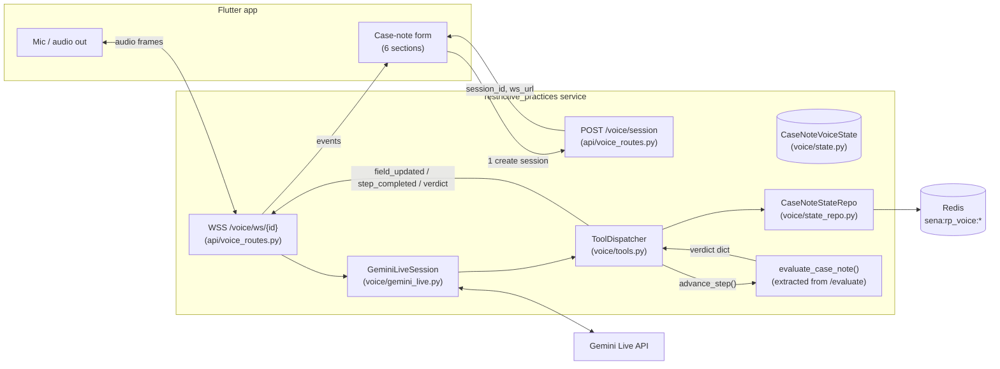

# Voice Assistant for Restrictive Practices — Refined Implementation Plan

## Context

Today, `services/restrictive_practices` accepts a post-shift voice note as a single audio blob, transcribes it via Amazon Transcribe (batch, 5–15 s), runs an LLM `/draft` pass to pre-fill the 6 case-note sections, and only then lets the worker review on screen. Failures (mis-transcription, missing required fields, ambiguous wording) surface late and force a full re-do.

The goal is a **conversational** flow that mirrors the proven `services/onboarding` voice bridge: WebSocket → Gemini Live → tool-driven field updates streamed back to the Flutter form in real time → on confirm, the server hands the assembled `CaseNoteInput` straight to the existing `/v1/restrictive-practices/evaluate` pipeline (triage → RAG → evaluator → cross-check → summary) and returns the verdict over the same WS.

**Strategy:** copy `services/onboarding/`'s voice stack into a new `restrictive_practices/voice/` package and rewire it for the case-note schema. No extraction of a shared `voice_bridge/` yet — that's a follow-up once a second consumer proves the abstraction.

**Verification gap to call out for the implementer:** this remote planning session has no access to `services/onboarding/` or `services/restrictive_practices/` source. Every file path, function signature, and behavior cited below comes from the draft handed to the planner and **must be confirmed against the local checkout** during step 0. Where a structural assumption is load-bearing (e.g. "FormState has `recompute_completion`"), the plan flags it.

## Architecture at a glance



The dashed coupling — `Tools → Eval` — is the one new integration point with the existing service; everything else is structural copy from onboarding.

## File layout (under `services/restrictive_practices/`)

```
voice/
  __init__.py
  gemini_live.py           copy from onboarding, rewire 3 imports
  tools.py                 WRITE — 5-tool FUNCTION_DECLS, no repeatables
  prompt_builder.py        copy, point at new template
  screen_context.py        copy unchanged
  resumption.py            copy unchanged
  grounding.py             copy unchanged
  schema_spec.py           copy unchanged
  coverage.py              copy unchanged
  field_apply.py           copy unchanged
  state.py                 WRITE — CaseNoteVoiceState (mirrors FormState)
  state_repo.py            copy, change key prefix + state type
  schema.py                WRITE — build_case_note_schema()
  validators/
    __init__.py
    base.py                copy
    sequencing.py          copy, drop repeatable branches
    field_rules.py         WRITE — minimal (cross-field: injury_description)
  prompts/
    case_note_system.md    WRITE — adapted from onboarding_system.md

api/
  voice_routes.py          NEW — POST /voice/session, WSS /voice/ws/{id}
main.py                    +include_router(voice_router)
config.py                  +7 env vars (gemini, redis, timeouts)
pyproject.toml             +google-genai>=0.7, +redis>=5, +fakeredis[lua] (dev)

tests/test_voice/          state, tools, repo, prompt, routes, integration
```

## Implementation order

The order matters — each step only depends on what's already in place.

1. **Read first** (no code yet). Open the onboarding files listed below and confirm the signatures/behaviour the rest of the plan assumes. If any diverges, surface it before continuing.
   - `services/onboarding/src/onboarding/services/{gemini_live,tools,prompt_builder,screen_context,resumption,grounding}.py`
   - `services/onboarding/src/onboarding/models/{form_state,schema_spec}.py`
   - `services/onboarding/src/onboarding/repositories/state_repo.py`
   - `services/onboarding/src/onboarding/api/{ws_routes,routes}.py`
   - `services/onboarding/src/onboarding/prompts/onboarding_system.md`
   - `services/restrictive_practices/models/schemas.py` (`CaseNoteInput`)
   - `services/restrictive_practices/api/routes.py` (the `/evaluate` body)
   - `services/restrictive_practices/CLAUDE.md`, `MOBILE_INTEGRATION_GUIDE.md`, `data_flow.md`
   - `.claude/rules/api.md` (WS event vocabulary)

2. **Deps + config.** Add `google-genai>=0.7.0`, `redis>=5.0.0`, `fakeredis[lua]>=2.20.0` (dev) to `pyproject.toml`. Add to `Settings` in `config.py`:
   ```
   gemini_api_key, gemini_live_model_id, redis_url,
   voice_session_max_sec=3600, voice_silence_timeout_sec=8,
   voice_validation_advisory=True, voice_grounding_enabled=False,
   screen_state_max_bytes=8192, resumption_handle_ttl_sec=600
   ```
   `SENA_AI_` env prefix matches existing pattern.

3. **State model — `voice/state.py`.** Write `CaseNoteVoiceState` (Pydantic) plus `FieldValue`, `FieldSource`, `CompletionStats` mirroring onboarding's `FormState`. Flat shape (no repeatable sections). Key methods:
   - `set_field(section, field, value, *, source, confidence, turn_id)` — stamps `updated_at`, stores as dict.
   - `to_case_note_input()` — flattens nested `values` to the existing `CaseNoteInput` field shape. Single source of truth for the bridge between voice state and the evaluator.
   - `recompute_completion(schema)` — same algorithm as onboarding's `FormState.recompute_completion`. **Verify name/signature** in step 1.
   - Confirmation-lock fields: `pending_confirmation`, `pending_batch`, `pending_validation_errors`.

4. **Schema — `voice/schema.py`.** `build_case_note_schema()` returns a `StepSchema` programmatically (no JSON fixture). 7 sections mapped 1:1 to `CaseNoteInput`: `shift`, `summary`, `activities`, `wellbeing`, `outcomes`, `safety`, `incidents`. The only conditional is `safety.injury_description` (`visible_if={"any_injuries": True}`) — relies on `prompt_builder._render_schema_filtering_hidden_fields` working with `visible_if`. **Verify** the onboarding prompt-builder supports that key (the draft asserts it does).

5. **State repo — `voice/state_repo.py`.** Copy onboarding's repo verbatim, then:
   - Change key prefix from `sena:onboarding:` → `sena:rp_voice:` everywhere. This is the only thing preventing cross-service Redis collisions and is the single most important diff in the file.
   - Replace `FormState` references with `CaseNoteVoiceState`.
   - Keep `assert_session_owner`, the WS lock helpers, the schema/transcript/resume keys, and TTL handling unchanged.

6. **Validators — `voice/validators/`.**
   - `base.py`: copy.
   - `sequencing.py`: copy, then remove the repeatable-section branches in `next_required_field` / `next_optional_field` / `validate_step_complete`. Keep the scalar-field path.
   - `field_rules.py`: write a minimal `validate_field(...)` that returns no rejections (placeholder so the tool dispatcher's import succeeds). Add one cross-field check: `if values.safety.any_injuries is True and not values.safety.injury_description: reject`.

7. **Prompt — `voice/prompts/case_note_system.md`.** Copy `onboarding_system.md`, then apply the surgical edits listed in the draft (§7): replace participant→worker framing, delete the 5 repeatable-related tool rows and all §5/Rule-6/Rule-9 repeatable subsections, drop Rule 12 (NDIS plan enums) and Rule 14 (routine sections), trim Rule 18 / delete 22 & 23, delete Rule 24 (cross-step intent). Add a "compliance disclaimer" rule: agent captures verbatim, never judges restrictive-practice severity. Update §10 to mention `advance_step` returns a verdict the agent reads back. **Keep**: JSON-as-Truth Protocol, §2 screen-is-source-of-truth, §4 dialogue state machine + tool-before-talk, §8 voice/interruption protocol, §9 sequencing & tone, and rules 1/3/4/5/7/7b/8/10/11/13/15/16/17/19/20/21/21a. Target ~450 lines.

8. **Prompt builder — `voice/prompt_builder.py`.** Copy onboarding's. Three changes:
   - `from onboarding.models.form_state import FormState` → `from voice.state import CaseNoteVoiceState as FormState`.
   - `SessionBootstrap` import: case notes are single-step, so either inline a minimal `SessionBootstrap` in `voice/state.py` or drop the field. **Decide based on what `build_system_prompt` actually does with it** (step 1 verification).
   - `_TEMPLATE_PATH` → `voice/prompts/case_note_system.md`.
   - Leave `_render_schema_filtering_hidden_fields` untouched.

9. **Tools — `voice/tools.py`.** This is the largest write. Mirror onboarding's `tools.py` structure (`FUNCTION_DECLS` list + `ToolDispatcher` class with one async handler per tool, returning `{"ok": bool, ...}` and emitting WS events via `self._emit`). Five tools only:
   - `update_field(section, field, value, confidence?, cross_section_intent?)` — port from onboarding minus the `repeatable_index` logic.
   - `clear_field(section, field)` — port minus repeatable.
   - `get_session_context()` — port; recap of filled vs. missing.
   - `advance_step(confirmation_transcript)` — **new logic**:
     1. Load state; run `validate_step_complete(schema, state)`; reject with `rejections` if anything required is unfilled.
     2. `case_note_input = state.to_case_note_input()`.
     3. `verdict = await self._run_evaluate(case_note_input)` (injected callable; see step 11).
     4. Set `state.completed = True`, `completed_at = now`, save with TTL.
     5. Emit `{type: "step_completed", state, verdict}`. Return `{"ok": True, "verdict": ...}`.
   - `escalate_incident(reason, transcript_excerpt?)` — port.
   - Keep: `PENDING_CONFIRMATION` confirmation lock for low-confidence captures, `cross_section_intent` auto-promote, the readonly_paths check (harmless even with no readonly fields).
   - Drop: all `add_repeatable_row` / `delete_repeatable_row` / `enter_repeatable_section` / `exit_repeatable_section` / `request_unknown_section` / `cross_screen_summary` / `user_context_repo` references.
   - `field_apply.build_envelope` coverage gate: omit for v1 (every field is voice-eligible). Document the decision.

10. **Gemini bridge — `voice/gemini_live.py`.** Copy onboarding's file. Rewire exactly three imports:
    ```python
    from voice.tools import FUNCTION_DECLS, POLICY_BLOCK_DECL, PolicyBlockSignal, ToolDispatcher
    from voice.prompt_builder import build_system_prompt
    from voice.state import CaseNoteVoiceState as FormState
    ```
    Everything else (audio relay, turn events, silence watchdog, resumption, transcript emission) is identical. **Verify** the named exports `POLICY_BLOCK_DECL` and `PolicyBlockSignal` exist in onboarding's `tools.py`; if their names differ, adjust the import.

11. **Extract `evaluate_case_note(payload: dict) -> dict`.** In `restrictive_practices/api/routes.py` (or a new `pipeline/__init__.py`), pull the body of `POST /evaluate` into a standalone async function. The HTTP handler becomes a thin wrapper: `req → evaluate_case_note(req.model_dump()) → EvaluateResponse(**result)`. The voice ToolDispatcher receives this function via constructor injection — no HTTP round-trip in-process.

12. **REST + WS routes — `api/voice_routes.py`.**
    - `POST /v1/restrictive-practices/voice/session` → create `CaseNoteVoiceState`, persist via repo with schema + TTL, return `{session_id, ws_url}`. `ws_url` scheme is `wss` if request scheme is `https`, else `ws`.
    - `WSS /v1/restrictive-practices/voice/ws/{session_id}` → acquire WS lock (close 4001 if held), load state/schema (close 4004 if missing), build `ToolDispatcher` with injected `evaluate_case_note`, build `GeminiLiveSession`, `await bridge.run()`, release lock in `finally`.
    - Register the router in `main.py` via `app.include_router(voice_router)`.

13. **Tests — `tests/test_voice/`** (target ≥30 cases):
    - `test_state.py`: `set_field`, `to_case_note_input` (assert the dict maps 1:1 to `CaseNoteInput`), `recompute_completion` for required/optional combinations.
    - `test_tools.py`: `update_field` happy path; rejection for unknown section/field; `clear_field`; `advance_step` rejects on missing required; `advance_step` calls injected `run_evaluate` and emits `step_completed` with verdict; `escalate_incident` appends.
    - `test_state_repo.py`: round-trip via `fakeredis`; `assert_session_owner` rejects cross-tenant; assert keys start with `sena:rp_voice:` (regression guard against onboarding collision).
    - `test_prompt_builder.py`: prompt contains `[LIVE_STATE_JSON]`; with `any_injuries=False`, `injury_description` is not in the rendered schema JSON; tool table lists 5 tools (no `add_repeatable_row`).
    - `test_voice_routes.py`: `POST /voice/session` returns a `ws_url`; second WS connect on same id is rejected (lock).
    - `test_integration.py`: stub `genai.live.connect`, run `update_field × N → advance_step`, assert `evaluate_case_note` got the right `CaseNoteInput` shape and `step_completed` carried the verdict.

14. **Wire-up + docs.**
    - `main.py`: register the router.
    - `restrictive_practices/CLAUDE.md`: add one paragraph linking to this guide.
    - Write `FLUTTER_VOICE_INTEGRATION.md` modelled on the existing onboarding Flutter doc. Subset of WS events the mobile app must handle: `ready`, `turn_start`, `turn_complete`, `interrupted`, `user_said`, `agent_said`, `field_updated`, `field_cleared`, `state`, `validation_rejection`, `step_completed` (now carries `verdict`), `escalated`, `error`, `go_away`, `resumable`. Document the echo-cancel rule (mute mic between `turn_start` and `turn_complete`/`interrupted`) and the `screen_state_v2` emit when focus changes or `any_injuries` toggles.

## Out of scope

- BSP voice editing.
- Cross-shift conversational memory.
- Translation.
- Real-time compliance hints during dictation (verdict is only on `advance_step`).
- Extracting `shared/voice_bridge/` — deferred to a follow-up once a second consumer exists.

## Verification

End-to-end smoke (do all five, in order):

1. `make server` → service on port 8084.
2. `curl -X POST http://localhost:8084/v1/restrictive-practices/voice/session -H 'Content-Type: application/json' -d '{"participant_id":"c-1","worker_id":"w-1","tenant_id":"t-1"}'` → `{session_id, ws_url}`.
3. `websocat` against `ws_url`; speak: "shift date is 21st of May". Expect a `field_updated` event with `section=shift, field=shift_date, value=2026-05-21`.
4. Fill every required field via dictation; say "yes submit". Expect `step_completed` with a `verdict` payload (same shape as `EvaluateResponse`).
5. `redis-cli KEYS 'sena:rp_voice:*'` shows state/schema/transcript keys with `EXPIRE` set. Server logs show the same triage/RAG/evaluator lines that `POST /evaluate` would emit.

Test gate: `pytest tests/test_voice/ -x -q` green (≥30 tests) before opening the PR.

## Assumptions that need confirming during step 1

These are the load-bearing claims the rest of the plan inherits from the draft. If any is wrong, the affected step needs rework — flag it before continuing.

- `services/onboarding/` exists at that path and exposes the files in §0 of the draft.
- `FormState.recompute_completion(schema)` exists with the listed algorithm.
- `prompt_builder._render_schema_filtering_hidden_fields` honours `visible_if`.
- Onboarding's `tools.py` exports `FUNCTION_DECLS`, `POLICY_BLOCK_DECL`, `PolicyBlockSignal`, `ToolDispatcher`.
- `state_repo.py`'s key pattern is parameterised enough that a prefix swap is a one-line change.
- `restrictive_practices/api/routes.py` `POST /evaluate` body is extractable into a pure async function without hidden FastAPI-only dependencies.
- The existing `CaseNoteInput` shape is exactly the set of fields enumerated in `to_case_note_input()` (step 3). Any drift here breaks `advance_step`.